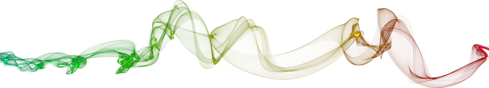

## `WELCOME FRIENDS 👋`

#### My name is `Basic Mirko` 🐵

**I LOVE what I do!!!** I am a full-stack developer who takes pride in writing extremely clean code and focuses on constant growth. As a web developer, I enjoy using my obsessive attention to detail, my unequivocal love for improvement and my mission-driven work ethic to leave my mark in the field.

I am interested in the entire full-stack spectrum but currently my major focus is on **[React](https://github.com/facebook/react)**. I have skills in other fields like typography, design and modeling. I take visuals of a web site just as seriously as a designer and believe the combination of both form and function is what makes a great user experience.

_________

#### What's *README* without a `GitHub` template? 😅

- *🔭 I’m currently working on integration of QR with NFT 🛠*
- *🌱 I’m currently learning everything about blockchain concepts ⛓️*
- *👯 I’m looking to meet other amazing people in the Web3 space ✊*
- *🤔 I’m looking to create something special that will benefit the community 🐾*
- *💬 Ask me about the purpose of life 🍀*
- *📫 How to reach me: [LinkedIn](https://www.linkedin.com/in/basic.mirko) | [GMail](mailto:bejzik8@gmail.com) | [Phone](tel:+381642158383) 🧭*
- *😄 Pronouns: he, him, his 🤷‍♂‍*
- *⚡ Fun fact: I used to breakdance, still can do the windmills 😎*

