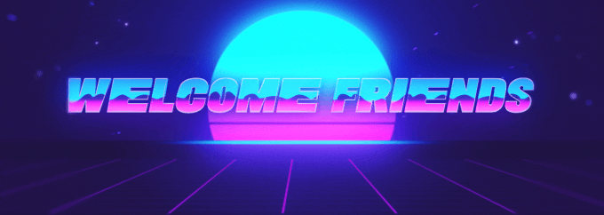

<!--  -->

<!--  -->

 

**I LOVE what I do!!!** I am a full-stack software engineer who takes pride in writing extremely clean, readable and minimal code and focuses on crafting future-proof web applications which are performant and easy to maintain. I value well-organized project structure, thoughtful interactions and innovative ideas. Really passionate about technology, I'm interested in the entire spectrum but my go-to technology is React. I devoted a lot of time getting to know it in-depth together with its whole ecosystem and I enjoy using it the most since it is unopinionated and everyone has a chance to adapt it to their own needs and express themselves in their own way. My abundant energy fuels me in the pursuit of many interests, I enjoy using my obsessive attention to detail, my unequivocal love for improvement and my mission-driven work ethic to continuously get better.I am currently in the process of fully shifting myself to Web3 space and decentralized web approach because I see it as a future, as a game-changer in the upcoming evolution of the internet. I am definitely sold on the idea! I am focused on learning everything about the existing concepts on blockchain because I think that we have a chance to create impactful changes in many ways and give a huge contribution for the better of the community.

#### What's _README_ without a `GitHub` template? 😅

-   _🔭 I’m currently working on integration of QR with NFT 🛠_
-   _🌱 I’m currently learning everything about blockchain concepts ⛓️_
-   _👯 I’m looking to meet other amazing people in the Web3 space ✊_
-   _🤔 I’m looking to create something special that will benefit the community 🐾_
-   _💬 Ask me about the purpose of life 🍀_
-   _📫 How to reach me: [Telegram](https://t.me/bejzik8) | [LinkedIn](https://www.linkedin.com/in/basic.mirko) | [GMail](mailto:bejzik8@gmail.com) 🧭_
-   _😄 Pronouns: he, him, his 🤷‍♂‍_
-   _⚡ Fun fact: I used to breakdance, still can do the windmills 😎_

## GitHub Stats 📈

